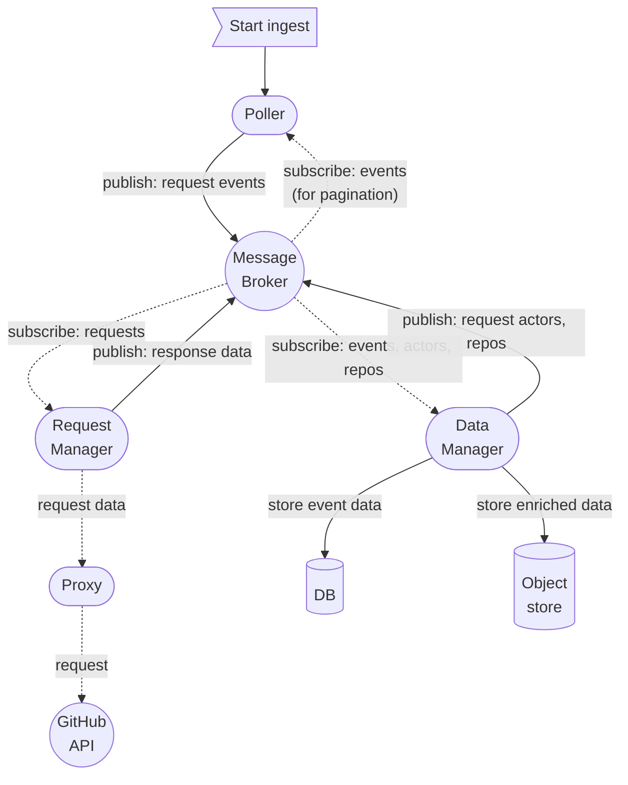

# Design Brief

This document describes the high-level architecture, design decisions, and tradeoffs
of the GitHub Event Monitor service.

## Problem Statement

This service is intended to monitor the GitHub Events API
by ingesting, enriching, and persisting events for later analysis.

### Technical Requirements

- The preferred framework is Ruby on Rails (API only mode is acceptable).
- The runtime environment must be a Docker Compose project.
- The system of record must be PostgreSQL.

### GitHub API

- Events should be ingested from the public [GitHub Events API](https://docs.github.com/en/rest/activity/events?apiVersion=2026-03-10#list-public-events).
- Do not use authentication
- Respect rate limits (and handle getting rate limited)
- For the purposes of this demonstration, the service will be limited to monitoring push events (`PushEvent`).

## Architecture

The driving factor behind the application's design is this:

> The GitHub API is a limited resource.

Therefore, the important design decisions to consider include:

- How to protect the service from getting rate limited (or worse)?
- How to ensure availability of the application when GitHub is unavailable?
- How to test the system given those constraints?

To address these considerations, the proposed architecture is a decoupled, modular system:

- Inter-service communication is performed asynchronously via a message broker using a publish / subscribe paradigm.
- Important and limited resources such as APIs and databases are guarded and abstracted.

The system is composed of four main services:
- **Request Manager:** Controls how frequently requests get sent to the GitHub API. Subscribes to requests and publishes response data to the appropriate topic.
- **Poller:** Periodically submits requests to get events from GitHub. Paginates the events response.
- **Proxy:** Acts as a façade to the GitHub API. Allows for changing the URL to a different API or even return mock data instead of making a call.
- **Data Manager:** Responsible for persisting data locally and making requests for enriching event data with additional information.

For completeness, the four remaining auxillary services are:

- **GitHub API:** The main data source.
- **Message Broker:** Responsible for receiving messages and updating subscribers.
- **Database:** System of record for persisting event data locally.
- **Object Store:** Responsible for storing additional information related to events, potentially temporarily.

## Key Tradeoffs and Assumptions

Designing services to make requests asynchronously introduces a layer of complexity that makes issues harder to debug.
However, it ensures that a surge in requests will not exceed the rate limit.
Furthermore, the "request queue" can be persisted and recovered in the event of service failure,
and failed requests can be re-queued automatically.

In the absence of any other performance requirements or observed runtime behavior,
the "Data Manager" service combines the processing of events, actors, and repos into a single service.
In the event that some part of this process ends up taking significantly more resources,
this design allows for the service to be split into multiple independent subscribers with little modification.

## Handling Rate Limits and Durability

The GitHub API documentation [Rate limits for the REST API](https://docs.github.com/en/rest/using-the-rest-api/rate-limits-for-the-rest-api?apiVersion=2026-03-10)
states that the rate limit for unauthenticated users making requests to the public API
are limited to 60 requests per hour (or 1 per minute).
There are further restrictions based on which endpoints and how they are called.

Furthermore, using the default values from the [Events API documentation](https://docs.github.com/en/rest/activity/events?apiVersion=2026-03-10)
can result in up to 300 events at a time, split into 20 pages (resulting in 20 requests).
If every event is a `PushEvent`, and every event produces 2 follow-on requests for enrichment data, that results in 300 * 2 = 600 additional requests, for a total of 620 requests _for a single ingestion_.

Careful tuning of the polling parameters is required both so that
the application does not overwhelm the GitHub API too quickly,
but also so that follow-on ingestion requests do not grow the request queue size indefinitely.
In the worst case, a single ingestion will take over 10 hours to fulfill safely.
In reality, not all events are `PushEvents`,
and further care can be taken to not make additional requests for data that is already in the system.

## Out-of-scope features

The following features that would normally be considered for a project of this type
will not be included in this demonstration due to time or resource constraints:

- authentication
- secrets management
- CI/CD pipelines
- data query API
- user interface
- start/stop endpoints for service processing
- service healthchecks

The following features were intended to be included but could not due to time or resource constraints:

- TBD
